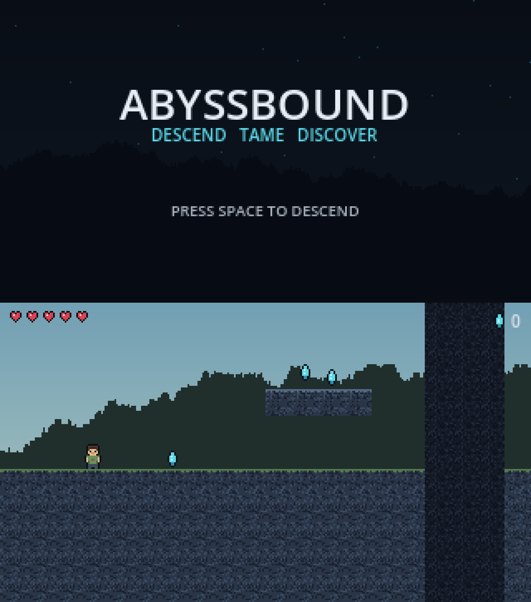

# BocciaBound

A 2D pixel-art platformer. You go down, you tame what you find, you see how deep it goes.

This repo is the placeholder. The engine, the build pipeline and the tests are real. The art and the levels are stand-ins, generated by scripts in `tools/` so they are easy to replace one piece at a time.



## What works right now

- Run and jump with coyote time, jump buffering and a variable jump height
- One enemy, the crawler. Walk into it and you lose a heart. Land on its head and it dies
- Crystals to pick up, hearts to lose, both shown in the HUD
- A critter you can tame. Stand near it and hold **E** until the trust bar fills, then it follows you
- Building: planks, platforms you climb through, doors that open, and walls
  that go up behind you, so a shelter is something you make
- Leather armour from what you hunt, makeable on the first day
- A pause menu on Esc with every key listed and a save button
- The Abyss descends in shelves rather than one long drop, so going down it is
  a climb
- Bats in the caves, which fly and swoop rather than walking at you
- Caves worth exploring: winding tunnels near the surface opening into
  chambers deeper down, all connected
- Chests waiting in them with tools, torches and materials, better the deeper
  you go, and life crystals that permanently add a heart
- A day and night cycle. The sun goes out, the world goes dark, and things
  come out that did not before
- Wildlife by day, hostiles by night, and a swing to answer them with
- Light keeps them off: a lit room is a safe one
- What you break falls on the ground and flies to you when you get close. A
  full bag means it waits rather than vanishing
- Armour from copper and iron at an anvil, which softens a hit but never
  stops one
- A hotbar, a backpack and crafting. Wood becomes torches and a workbench;
  the workbench unlocks tools; a furnace smelts ore into bars; an anvil turns
  bars into better tools

## Play it

**In a browser, nothing to install: [bocciabound.vercel.app](https://bocciabound.vercel.app)**

That is the current `main`, redeployed by CI on every push.


**Fastest, and what the screenshots come from.** Godot 4.6 is needed once, from
[godotengine.org/download](https://godotengine.org/download), the standard
build and not .NET. Then:

```
./tools/play.sh                          a new world every run
./tools/play.sh --seed=20260910          the world in docs/playtest-log.md
./tools/play.sh --seed=7 --spawn-x=1000  drop in at the mouth of the Abyss
./tools/play.sh --start --seed=7         skip the title screen
```

The seed is printed at startup, so a world worth keeping can be got back. If
Godot lives somewhere unusual, set `GODOT=/path/to/godot`.

**In a browser, on your own machine.**

```
./tools/serve_web.sh
```

That exports the web build and serves it at `http://localhost:8060/index.html`.
Query parameters work the same as the flags:
`?start&seed=20260910&spawn-x=1000`, where `start` skips the title screen.
Press **F3** once it loads to see the real frame rate on real hardware, which
is the only place that number means anything: CI has no GPU and renders in
software, so it can only prove the build runs, not how fast.

**Nothing installed at all.** Download a build from
[Releases](https://github.com/vinceovereem/bocciabound/releases). Windows is one
`.exe`: double-click it and choose **More info, Run anyway**.

Mac is a `.zip`. Unzip it and then run one line in Terminal:

```
xattr -dr com.apple.quarantine ~/Downloads/BocciaBound.app
```

After that it opens by double-clicking. The app is not signed with an Apple
developer certificate, and **on macOS 15 and later the old right-click and
Open trick no longer works** — that advice used to be in this file and it was
wrong for anything recent. The alternative without Terminal is to let macOS
refuse once, then go to **System Settings, Privacy and Security**, scroll to
Security, and press **Open Anyway**.

### What there is to do

The top left corner lists the next few things worth doing: gather wood, mine
stone, place a torch, live through a night, find copper, dig deep, reach the
Abyss. They are nudges rather than quests. Nothing is gated on them and nothing
is lost by ignoring them, but a new world is a big empty place and they give
you somewhere to point yourself. The list lives in `data/objectives.json` and
adding to it needs no code.

### What to try first

1. Walk east and look for a hole in the ground. The surface is dotted with cave
   mouths; follow one down rather than digging your own shaft.
2. Hold the left mouse button on a tile to dig it. Break time depends on the rock.
3. Press **Q** twice to select the torch, then right-click to place it. Then dig
   down far enough that it matters.
6. **Find a chest.** They sit on cave floors from the cavern layer down. Stand
   next to one and press **E**. A deep one holds a better pickaxe than you could
   make. Life crystals glow red and give you a heart when you mine them.
7. **Wait for dark.** A day is twenty real minutes, the clock is at the top of
   the screen, and things come out at night. Dig into a hillside, put a torch
   down, and nothing spawns in the light.
8. Press **F3** at any point to see the seed, the biome, the depth, the time and
   what the nearest creature is doing.

### Hosting the web build

`.github/workflows/ci.yml` deploys the browser build to Vercel on every push to
`main`, and on a manual run of the workflow. The three secrets it needs are
set. If you ever need to recreate them:

| Secret | Where to get it |
| --- | --- |
| `VERCEL_TOKEN` | vercel.com/account/tokens, create one |
| `VERCEL_ORG_ID` | run `vercel link` in this folder, then read `.vercel/project.json` |
| `VERCEL_PROJECT_ID` | same file |

GitHub Pages is set up as a backup. To use it instead, enable Pages in
**Settings > Pages** with GitHub Actions as the source, then add a repository
variable `ENABLE_PAGES` set to `true`.

## Controls

| Key | Action |
| --- | --- |
| A / D or arrows | Move. Single tile ledges are walked up, not jumped |
| Space / W | Jump. Hold for a higher jump. Up now aims the dig |
| F | Dig. Reaches one tile, aimed with the movement keys |
| Down + F | Dig the block under your feet |
| Up + F | Dig the block over your head |
| G | Use what you are holding: place a block, or put armour on |
| X | Swing. Aimed the same way as digging |
| Up arrow | Jumps, and aims the dig upward |
| 1 to 0 | Pick a hotbar slot. What is in it is what you place |
| Arrows in the bag | Move between items. Enter brings one to hand |
| Q | Next hotbar slot |
| E | Open a chest you are standing next to |
| I | Backpack. Shows what you are wearing and your defence |
| C | Crafting. While it is open, the number keys make things |
| F3 | Debug overlay: seed, fps, light cost, biome, depth |
| E | Tame a critter (the archived zones only, for now) |
| R | Restart |
| Esc | Pause menu: the full key list, save, quit |

A gamepad works too.

### Editor shortcuts

Godot uses different keys on Mac. Worth knowing before you go hunting for F5.

| Action | Mac | Windows and Linux |
| --- | --- | --- |
| Run project | Cmd+B | F5 |
| Run current scene | Cmd+R | F6 |
| Stop | Cmd+. | F8 |

## Layout

```
assets/       Sprites, tiles and backdrops. All generated by tools/gen_art.py
levels/       Zone maps as plain text. Generated by tools/gen_levels.py
scenes/       Godot scenes: actors, pickups, levels, UI
scripts/      GDScript. One file per behaviour
tests/        Headless smoke test that CI runs on every push
tools/        The art and level generators
docs/         How the pieces fit together
```

## Changing things

**The art.** Open `tools/gen_art.py`. The palette is at the top and every sprite is an ASCII grid below it. Change a character, run `python3 tools/gen_art.py`, and the sprite sheet is rebuilt. When you have real art, drop the PNGs into `assets/` at the same sizes and delete the generator.

**The levels.** Open a file in `levels/`. It is a text map with one character per tile, and the legend is in the header of each file. Edit it in any text editor and re-run the project in Godot. `tools/gen_levels.py` rebuilds them from scratch and checks that no pit is too wide to jump and nothing is out of reach.

**The feel.** Open `scenes/actors/player.tscn` in Godot and look at the inspector. Speed, jump height, gravity, coyote time and knockback are all there. Change a number, run the project, see how it feels. Nothing in `scripts/player.gd` needs touching.

## Tests

```
godot --headless --path . res://tests/smoke_test.tscn
```

39 checks. It loads all three zones, counts what spawned, drops a real player onto a real floor, measures the jump, collects a crystal and stomps a crawler. It exits non-zero if anything is wrong, and CI blocks the build on it.

## Building

CI builds Web, Windows, macOS and Linux on every push and attaches them to the run as artifacts. The web build also goes to Vercel.

The Windows and Linux builds embed the game data in the executable, so each one is a single file you can send to someone. The Mac build is an `.app` bundle inside a `.zip`, because that is what macOS needs. Do not turn `binary_format/embed_pck` off unless you want to hand out two files that must stay in the same folder. To build locally, open the project in Godot and use **Project > Export**. The presets are already set up in `export_presets.cfg`.

One thing to know: the level maps are `.txt` files, not Godot resources, so they only get packed because `include_filter` in `export_presets.cfg` names them. If you add another non-resource file type, add it there too or it will be missing from the exported game and work fine in the editor.

## Sending the game to someone

Actions artifacts are no good for this. They expire, and downloading one needs a
GitHub account. Cut a release instead:

```
git tag v0.1.0
git push origin v0.1.0
```

CI builds the tag and publishes a release at
`github.com/vinceovereem/bocciabound/releases`. Anyone with the link can download
it, no account needed. Send them the release page and they pick their platform:

| Machine | File | 
| --- | --- |
| Windows | `BocciaBound-v0.1.0-Windows.exe`, one file, double-click it |
| Mac | `BocciaBound-v0.1.0-macOS.zip`, unzip and run the app inside |

Tag as `vMAJOR.MINOR.PATCH`. CI stamps that number into the Mac app, which is
what shows in Get Info, so the version cannot drift from the tag. A tag with no
`MAJOR.MINOR.PATCH` in it fails the build on purpose rather than shipping a
build labelled with the wrong version.

Both builds are unsigned, because signing costs money on both platforms: 99 USD
a year for Apple, a few hundred for a Windows certificate. So both warn on first
launch, and the release notes spell out the way past it.

- **Windows** says it does not recognise the app. **More info**, then **Run anyway**.
- **Mac** needs a **right-click** on the app and **Open**, then **Open** again. Tell people this. Double-clicking an unnotarised app gives a dialog with no way forward, which reads as a broken download.

If that friction is not worth it, send the Vercel link instead. The browser build
needs no download and no warnings.

## Licence

MIT. See `LICENSE`.
